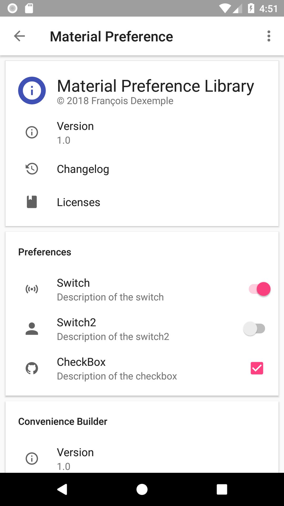
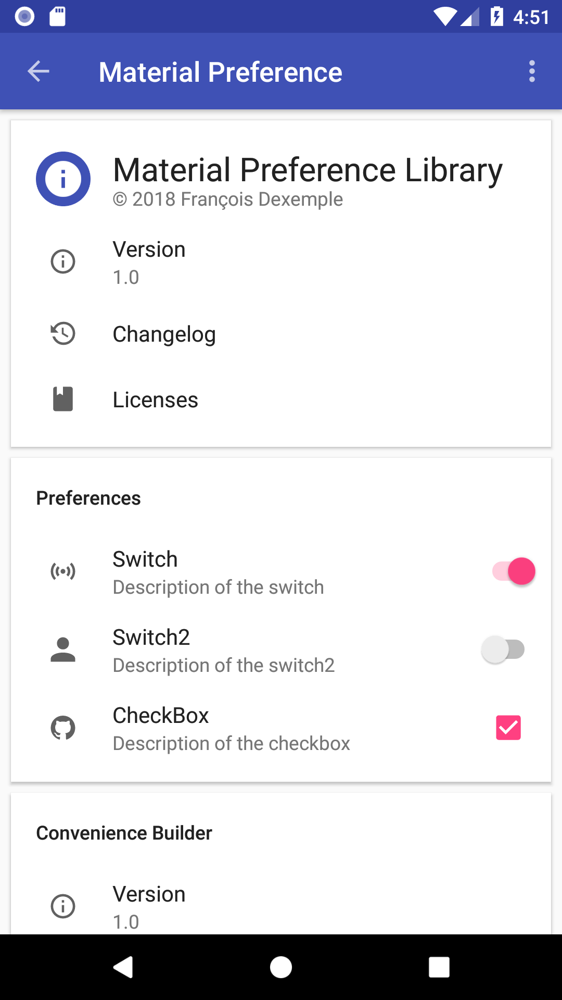
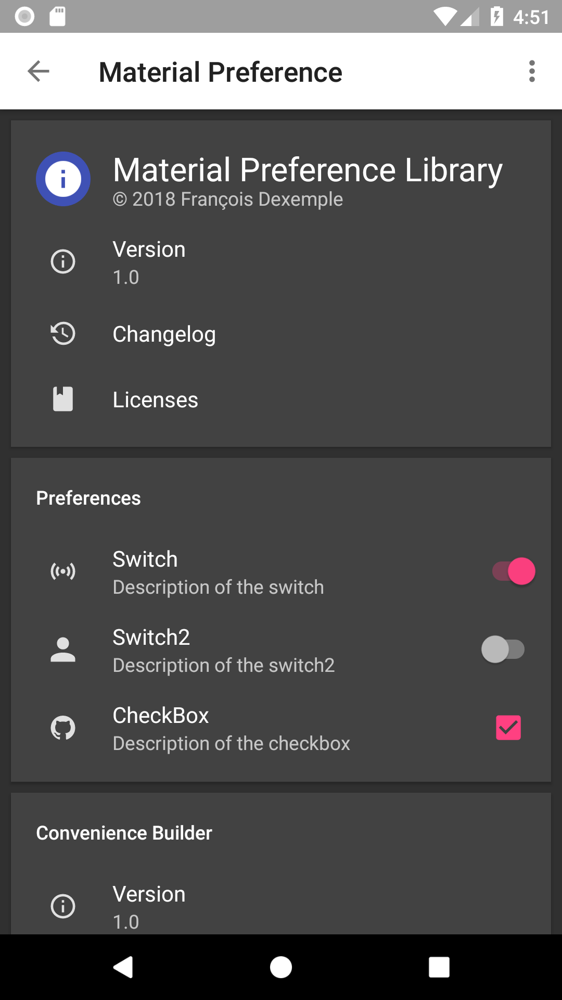
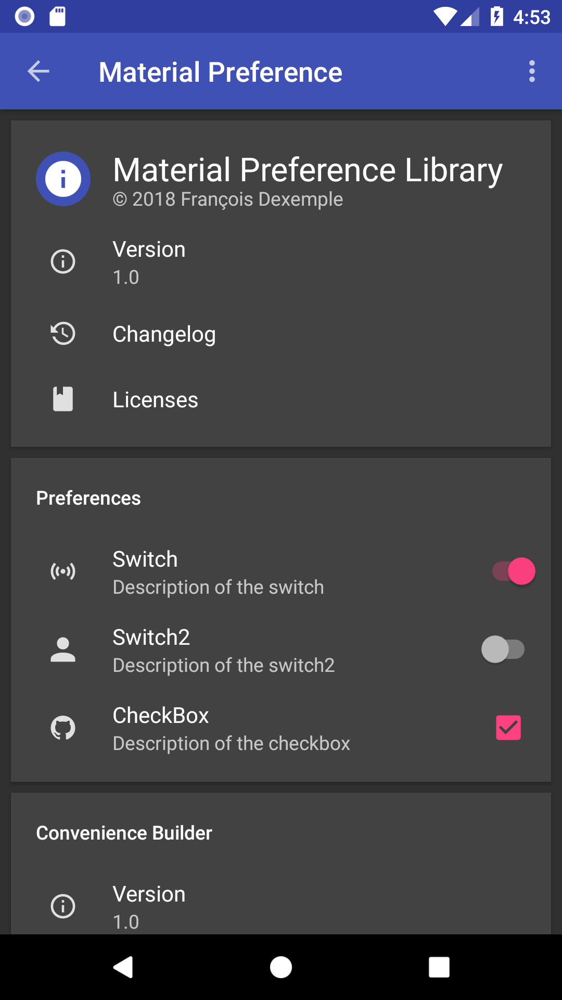
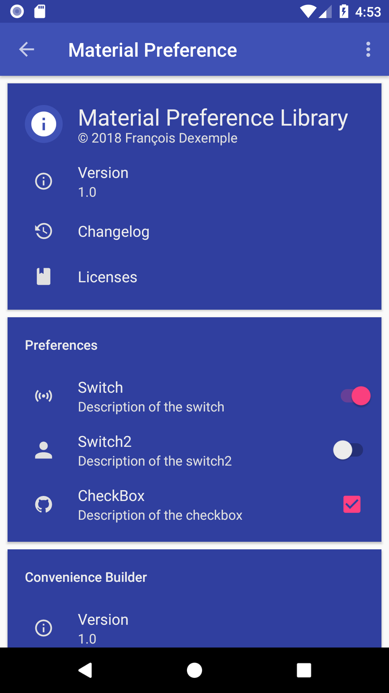
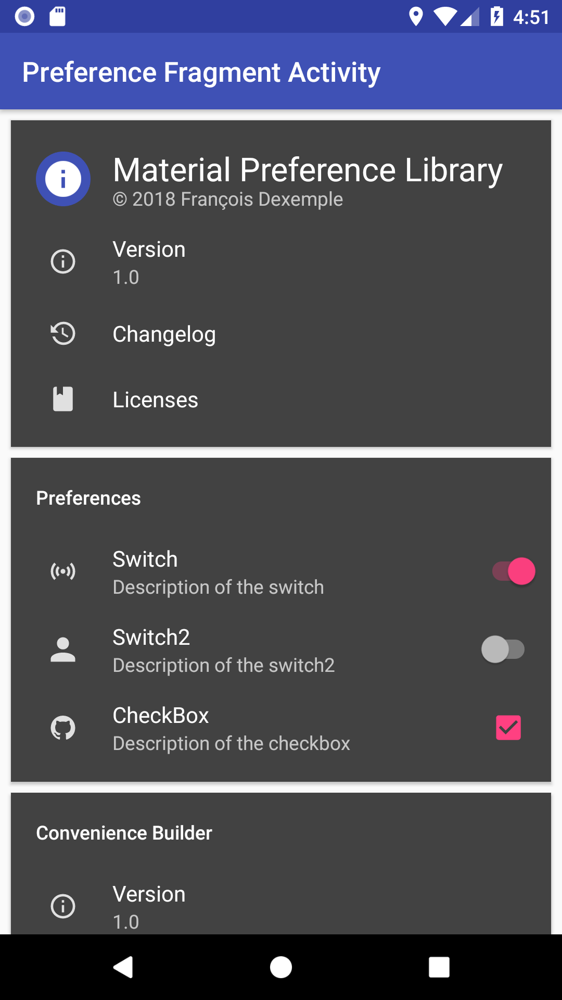

# material-preference-library

Makes it easy to create a beautiful preference screen for your app. Generates an `Activity` or `Fragment`.

Fork from here: [material-about-library from daniel-stoneuk][6]

If you use this library in your app, please let me know and I'll add it to the list.


## Screenshots

| Light with Light Action Bar    | Light with Dark Action Bar     | Dark with Light Action Bar    | Dark with Dark Action Bar     | Custom Cardview Background     | Custom card & action item layout |
| ------------------------------ | ------------------------------ | ------------------------------ | ------------------------------ | ------------------------------ |  ------------------------------ |
|  |  |  |  |  |  |

## Features

- Material design
- Modular backend
- Easy to implement
- Simple but intuitive API
- Dynamic item support
- Support Switch and Checkbox (more after)

## Dependency

Comming soon

## Setup

### Activity

Your `Activity` must extend [`MaterialPreferenceActivity`][materialpreferenceactivityjava] and be in your _AndroidManifest.xml_:

```java
public class ExampleMaterialPreferenceActivity extends MaterialPreferenceActivity {

    @Override
    @NonNull
    protected MaterialPreferenceList getMaterialPreferenceList(@NonNull Context context) {
        return new MaterialPreferenceList.Builder()
                .build(); // This creates an empty screen, add cards with .addCard()
    }

    @Override
    protected CharSequence getActivityTitle() {
        return getString(R.string.mp_title_preference);
    }

}
```

Ensure that the theme extends either of these themes, and apply primary & accent colours:

- `Theme.mp.Light` (light theme with light toolbar)
- `Theme.mp.Light.DarkActionBar` (light theme with dark toolbar)
- `Theme.mp.Dark` (dark theme with dark toolbar)
- `Theme.mp.Dark.LightActionBar` (dark theme with light toolbar)

```xml
<manifest ...>
    <application ...>
        <activity android:name=".ExampleMaterialPreferenceActivity"
            android:theme="@style/AppTheme.MaterialPreferenceActivity"/>
    </application>
</manifest>
```

```xml
<style name="AppTheme.MaterialPreferenceActivity" parent="Theme.mp.Light">
    <item name="colorPrimary">@color/colorPrimary</item>
    <item name="colorPrimaryDark">@color/colorPrimaryDark</item>
    <item name="colorAccent">@color/colorAccent</item>
</style>
```

### Fragment

Your `Fragment` must extend [`MaterialPreferenceFragment`][materialpreferencefragmentjava].

```java
public class ExampleMaterialPreferenceFragment extends MaterialPreferenceFragment {

    @Override
    protected MaterialPreferenceList getMaterialPreferenceList(final Context activityContext) {
        return new MaterialPreferenceList.Builder()
                .build(); // This creates an empty screen, add cards with .addCard()
    }

    @Override
    protected int getTheme() {
        return R.style.AppTheme_MaterialPreferenceActivity_Fragment;
    }

}
```

Pass in a theme that extends one of the styles above

```xml
<style name="AppTheme.MaterialPreferenceActivity.Fragment" parent="Theme.mp.Light">
    <item name="colorPrimary">@color/colorPrimary</item>
    <item name="colorPrimaryDark">@color/colorPrimaryDark</item>
    <item name="colorAccent">@color/colorAccent</item>
</style>
```

### Add Cards:

Start building a "card" using [`MaterialPreferenceCard.Builder()`][8]

```java
public class ExampleMaterialPreferenceActivity extends MaterialPreferenceActivity {

    @Override
    @NonNull
    protected MaterialPreferenceList getMaterialPreferenceList(@NonNull Context context) {
        MaterialPreferenceCard card = new MaterialPreferenceCard.Builder()
                // Configure card here
                .build();

        return new MaterialPreferenceList.Builder()
                    .addCard(card)
                    .build();
    }
}
```

Give the card a title by calling `.title()` on the `MaterialPreferenceCard.Builder`

```java
MaterialPreferenceCard card = new MaterialPreferenceCard.Builder()
    .title("Author")
    .build();
```

### Add Items to a card:

There are currently 4 types of items you can add to a card - [`MaterialPreferenceTitleItem`][9], [`MaterialPreferenceActionItem`][10], [`MaterialPreferenceCheckboxItem`][12] and [`MaterialPreferenceSwitchItem`][13]. Other types of items are planned, for example "person" items which feature buttons to showcase a single person. Feel free to submit a PR or Issue for more item ideas.

- `MaterialPreferenceActionItem`: Standard item with text, icon and optional subtext.
- `MaterialPreferenceTitleItem`: Larger item with large icon (e.g. app icon) and larger text.

[`MaterialPreferenceTitleItem`][9] is created with [`MaterialPreferenceTitleItem.Builder()`][9] and lets you specify **text** and an **icon**.

```java
MaterialPreferenceCard.Builder cardBuilder = new MaterialPreferenceCard.Builder();
cardBuilder.addItem(new MaterialPreferenceTitleItem.Builder()
        .text("Material Preference Library")
        .icon(R.mipmap.ic_launcher)
        .build());
```

[`MaterialPreferenceItem`][10] is created with [`MaterialPreferenceItem.Builder()`][10] and lets you specify **text**, **sub-text**, an **icon** and an **OnClickAction**.

```java
cardBuilder.addItem(new MaterialPreferenceActionItem.Builder()
        .text("Version")
        .subText("1.0.0")
        .icon(R.drawable.ic_about_info)
        .setOnClickAction(new MaterialPreferenceActionItem.OnClickAction() {
            @Override
            public void onClick() {
                Toast.makeText(ExampleMaterialPreferenceActivity.this, "Version Tapped", Toast.LENGTH_SHORT)
                        .show();
            }
        })
        .build());
```

[`MaterialPreferenceCheckboxItem`][12] is created with [`MaterialPreferenceCheckboxItem.Builder()`][12] and lets you specify **text**, **sub-text**, an **icon** and an **onCheckedChangedListener**.

```java
cardBuilder.addItem(new MaterialPreferenceCheckboxItem.Builder()
        .text("Activate something")
        .subText("desciption")
        .icon(R.drawable.ic_about_info)
        .setOnCheckedChanged(new MaterialPreferenceOnCheckedChangedListener() {
                    @Override
                    public void onCheckedChanged(CompoundButton buttonView, boolean isChecked) {
                        Toast.makeText(c,"Now : "+isChecked,Toast.LENGTH_SHORT).show();
                    }
                })
        .build());
```


[`MaterialPreferenceSwitchItem`][10] is created with [`MaterialPreferenceSwitchItem.Builder()`][10] and lets you specify **text**, **sub-text**, an **icon** and an **onCheckedChangedListener**.

```java
cardBuilder.addItem(new MaterialPreferenceSwitchItem.Builder()
        .text("Version")
        .subText("1.0.0")
        .icon(R.drawable.ic_about_info)
        .setOnCheckedChanged(new MaterialPreferenceOnCheckedChangedListener() {
                    @Override
                    public void onCheckedChanged(CompoundButton buttonView, boolean isChecked) {
                        Toast.makeText(c,"Now : "+isChecked,Toast.LENGTH_SHORT).show();
                    }
                })
        .build());
```

### Return the list:

Create a [`MaterialPreferenceList`][11] using [`MaterialPreferenceList.Builder()`][11], passing in the cards you would like to display.

```java
MaterialPreferenceCard card = new MaterialPreferenceCard.Builder()
        .title("Hey! I'm a card")
        .build();

return new MaterialPreferenceList.Builder()
        .addCard(card)
        .build();
```

Check out a working example in [`Demo.java`][3].

**Tip:** You can either use _Strings_ / _Drawables_ or _Resources_ when creating `MaterialPreferenceItem`'s

**Tip:** Use [Android-Iconics][iconics] for icons. "Android-Iconics - Use any icon font, or vector (.svg) as drawable in your application."

**Tip:** Use [ConvenienceBuilder][conveniencebuilderjava] to easily create items or OnClickActions.

**Tip:** Customise text colour and card colour in your styles. Example below:

```xml
<style name="AppTheme.MaterialPreferenceActivity.Light.CustomCardView" parent="Theme.mp.Light">
    <!-- Customize your theme here. -->
    <item name="colorPrimary">@color/colorPrimary</item>
    <item name="colorPrimaryDark">@color/colorPrimaryDark</item>
    <item name="colorAccent">@color/colorAccent</item>
    <item name="mp_card_background">@color/colorPrimaryDark</item>
    <item name="android:textColorPrimary">#eee</item>
    <item name="android:textColorSecondary">#ffe0e0e0</item>
    <item name="mp_color_primary">#eee</item>
    <item name="mp_color_secondary">#ffe0e0e0</item>
    <!-- You can specify custom theme for toolbar and toolbarPopup. -->
    <item name="mp_toolbarTheme">@style/Theme.mp.Toolbar.Dark</item>
    <item name="mp_toolbarPopupTheme">@style/Theme.mp.Toolbar.Dark</item>
</style>
```

### Dynamic items:
It's possible to create dynamic items that either change on tap (or when any other event occurs). There are two examples in the sample application. Simply change the items in the list variable and then call `refreshMaterialPreferenceList()`. DiffUtil calculates the changes to animate in the RecyclerView.

```java
final MaterialPreferenceActionItem item = new MaterialPreferenceActionItem.Builder()
                .text("Dynamic UI")
                .subText(subText)
                .icon(new IconicsDrawable(c)
                        .icon(CommunityMaterial.Icon.cmd_refresh)
                        .color(ContextCompat.getColor(c, R.color.mp_color_icon_dark_theme)
                        ).sizeDp(18))
                .build();
        item.setOnClickAction(new MaterialPreferenceItemOnClickAction() {
            @Override
            public void onClick() {
                item.setSubText("Random number: " + ((int) (Math.random() * 10)));
                refreshMaterialPreferenceList();
            }
        });
```

### Custom card and Action layout
To get a layout that is similar to the 6th screenshot above simply override the files `mp_material_preference_action_item` and `mp_material_preference_list_card` by creating new layout resources with the same filename. See [here](https://github.com/filol/material-preference-library/tree/master/materialpreference/src/main/res/layout).

## Contributors

### This Library
- François Dexemple ([@filol](https://github.com/filol))

### Original Library
- Daniel Stone ([@daniel-stoneuk](https://github.com/daniel-stoneuk))
- Robert Pösel ([@Robyer](https://github.com/Robyer))
- Jonas Uekötter ([@ueman](https://github.com/ueman))
- Rainer Lang ([@Rainer-Lang](https://github.com/rainer-lang))
- Sebastian Guillen ([@code-schreiber](https://github.com/code-schreiber))
- and [others](https://github.com/daniel-stoneuk/material-about-library/graphs/contributors)

## License

```
Copyright 2016-2018 François Dexemple

Licensed under the Apache License, Version 2.0 (the "License");
you may not use this file except in compliance with the License.
You may obtain a copy of the License at

   http://www.apache.org/licenses/LICENSE-2.0

Unless required by applicable law or agreed to in writing, software
distributed under the License is distributed on an "AS IS" BASIS,
WITHOUT WARRANTIES OR CONDITIONS OF ANY KIND, either express or implied.
See the License for the specific language governing permissions and
limitations under the License.
```

[1]: https://jitpack.io
[2]: http://i.imgur.com/xXWDmLb.png
[3]: https://github.com/filol/material-preference-library/blob/master/app/src/main/java/com/francoisdexemple/materialpreferencedemo/Demo.java
[4]: http://i.imgur.com/HEm08Ax.png
[5]: https://play.google.com/store/apps/details?id=com.danielstone.energyhive
[6]: https://github.com/daniel-stoneuk/material-about-library
[8]: https://github.com/filol/material-preference-library/blob/master/materialpreference/src/main/java/com/francoisdexemple/materialpreference/model/MaterialPreferenceCard.java
[9]: https://github.com/filol/material-preference-library/blob/master/materialpreference/src/main/java/com/francoisdexemple/materialpreference/items/MaterialPreferenceTitleItem.java
[10]: https://github.com/filol/material-preference-library/blob/master/materialpreference/src/main/java/com/francoisdexemple/materialpreference/items/MaterialPreferenceActionItem.java
[11]: https://github.com/filol/material-preference-library/blob/master/materialpreference/src/main/java/com/francoisdexemple/materialpreference/model/MaterialPreferenceList.java
[12]: https://github.com/filol/material-preference-library/blob/master/materialpreference/src/main/java/com/francoisdexemple/materialpreference/items/MaterialPreferenceCheckBoxItem.java
[13]: https://github.com/filol/material-preference-library/blob/master/materialpreference/src/main/java/com/francoisdexemple/materialpreference/items/MaterialPreferenceSwitchItem.java
[conveniencebuilderjava]: https://github.com/filol/material-preference-library/blob/master/materialpreference/src/main/java/com/francoisdexemple/materialpreference/ConvenienceBuilder.java
[iconics]: https://github.com/mikepenz/Android-Iconics
[materialpreferenceactivityjava]: https://github.com/filol/material-preference-library/blob/master/app/src/main/java/com/francoisdexemple/materialpreferencedemo/ExampleMaterialPreferenceActivity.java
[materialpreferencefragmentjava]: https://github.com/filol/material-preference-library/blob/master/app/src/main/java/com/francoisdexemple/materialpreferencedemo/ExampleMaterialPreferenceFragment.java
